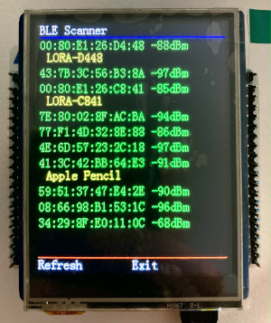

The demo application
====================

Original code modifications
---------------------------

First step was to correctly assign pins to the Nucleo board.
Pin mapping between the `Nucleo WB55 board`_ and the TFT28-105_ shield is as follows:

.. _Nucleo WB55 board: https://os.mbed.com/platforms/ST-Nucleo-WB55RG/
.. _TFT28-105: https://www.displaymodule.com/products/dm-tft28-105

+--------------+--------------------+-------------------+-------------------+
| DM-TFT28-105 | P-NUCLEO-STM32WB55 | Arduino name      | Description       |
+==============+====================+===================+===================+
| TFT_CS       | PA4                | D10               | TFT Chip Select   |
+--------------+--------------------+-------------------+-------------------+
| TFT_D/C      | PA9                | D9                | TFT Data/Command  |
+--------------+--------------------+-------------------+-------------------+
| T_CS         | PC6                | D2                | Touch Chip select |
+--------------+--------------------+-------------------+-------------------+
| T_IRQ        | PA10               | D3                | Touch PENIRQ      |
+--------------+--------------------+-------------------+-------------------+
| SD_CS        | PC10               | D4                | SD Card select    |
+--------------+--------------------+-------------------+-------------------+
| F_CS         | PA15               | D5                | Flash Memory CS   |
+--------------+--------------------+-------------------+-------------------+
| SCLK         | PA5                | D13               | SPI Clock         |
+--------------+--------------------+-------------------+-------------------+
| MISO         | PA6                | D12               | SPI MISO          |
+--------------+--------------------+-------------------+-------------------+
| MOSI         | PA7                | D11               | SPI MOSI          |
+--------------+--------------------+-------------------+-------------------+

Interface with TFTF28-105 parts is based on SPI solely. We have to deal with very different frequencies for each controllers:

+--------------+-------------+--------------------+
| Part         |  IC         | Clock freq. (max.) |
+==============+=============+====================+
| TFT          | ILI9341     | 14 MHz             |
+--------------+-------------+--------------------+
| Touch        | XPT2046     | 2.5 MHz            |
+--------------+-------------+--------------------+
| Flash Memory | W25Q32BV    | 50 MHz             |
+--------------+-------------+--------------------+

The original has been ported from C++ to C. Not that I dislike C++, but it is totally useless here and generates too much code.

Moreover, I found that communication with the TFT module was too slow and these parts have been rewritten (approximately a
factor of 10 has been achieved). The culprit was an unnecessary repeated sequence of CS - 2 byte transfer - /CS operations that slowed down
things a lot. Using SPI capabilities and intermediate buffer use for repeated values made things a lot faster.

The touch part has also been almost entirely rewritten. First, the documentation on the XPT2046 is inaccurate and misleading.
Code was also misleading in the correct interpretation of the PENIRQ output from the chip. A resistive touch interface mainly
consists in ADC conversion after applying voltage either on Y axis or the X to measure the position in X or Y respectively.
Conversion is triggered by CS signal and setting voltage drivers on and off approprietally. This was not properly done and a lot
of code to compensate "weird" values and final X,Y position was trying to fix things. This has been completely cleaned up.

As mentioned above, SPI speed is changed when addressing a module or another. Due to a choice of 32MHz for Core-0, the SPI clock
prescaler allows 8, 2 and 32MHz for TFT, Touch and Flash memory module respectively.

The demo application shows the display possibilities:

.. video:: _static/demo.mp4
    :width: 300

You can see that screen clearing and image drawing is decently fast.

Let's add the BLE scanner function since we seat on a WB55.

BLE scanner
-----------

The basic BLE code to install stack and make it run is MX generated. Then, a simple scan is scheduled thanks to **aci_gap_start_general_discovery_proc**.
The code waits for **le_advertising_event** to collect RSSI, visible name and remote addresses and report them in the application that draws the information
onto the screen.

