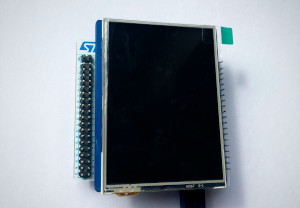

Hardware
========

DisplayModule
-------------

The DM-TFT28-105_ module is available at DisplayModule_'s site. They provide lots of OLED, TFT, LCD- E-paper screen modules. This one is arduino connector compatible and
easy to stack on ST Nucleo boards.

.. _DM-TFT28-105: https://www.displaymodule.com/products/dm-tft28-105
.. _DisplayModule: https://www.displaymodule.com

Technical brief:

- 2.8" TFT screen (240x320, RGB 16bit/pixel)
- Resistive touch
- 4MB Flash
- SD slot

STMicroelectronics
------------------

STM32WB55 serie is the target here and the P-Nucleo-WB55RG_  is a nice board to play with.
Technical brief:

- STM32 family with M4+M0 cores (dual core)
- 2.4GHz capable with 802.15.4, BLE4/5, ZigBee, OpenThread protocol stack firmware
- On-board ST-LINK
- USB connectors, 3 LEDs, buttons
- Battery socket

.. _P-Nucleo-WB55RG: https://www.st.com/en/evaluation-tools/p-nucleo-wb55.html
