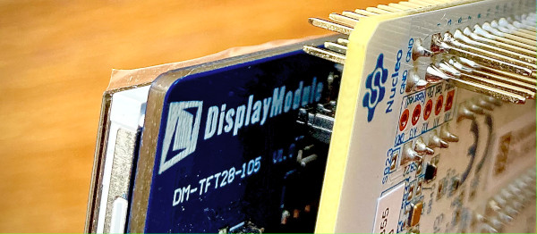

.. TFT28-105 on STM32WB55 documentation master file, created by
   sphinx-quickstart on Thu Sep  2 10:49:24 2021.

.. image:: images/GitHub-Mark-64px.png

The whole project is hosted at `GitHub <https://github.com/OliverSwift/TFT28-105-STM32WB55>`_.

TFT28-105 on STM32WB55
======================

The project is to use nifty `DisplayModule TFT28-105`_ on Nucleo board and more specifically on a STM32WB55 one.
This can be used as a boiler plate for small devices that require HMI for domotics or larger device control.

The original software sources (2015) were for mbed platform only and very slow. This new code is C code only, much faster and
more adequate for reactive interaction.

.. _DisplayModule TFT28-105: https://www.displaymodule.com/products/dm-tft28-105

.. toctree::
   :maxdepth: 2
   :caption: Contents:

   hardware
   software
   application
   ancs
